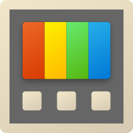

#  powertoys

## 🪟 fancyzones

### 💸 tips

- an easy way to generate grids to start with is the default grid layout in `layout-templates.json`, located in `C:\Users\YOURUSERNAME\AppData\Local\Microsoft\PowerToys\FancyZones`.
  - you can increase the zones to 128 with the slider, but if you edit the json file you can get up to 401 zones.
  - just duplicate the grid template with the number of zones you want and edit as needed.
- use `ctrl` + `shift` drag to select multiple cells.

### 💾 usage

1. make a backup of your `custom-layouts.json`, located in `C:\Users\YOURUSERNAME\AppData\Local\Microsoft\PowerToys\FancyZones`.
2. copy relevant parts of my `custom-layouts.json` to your own `custom-layouts.json`. for example:

```json
    {
      "uuid": "{24172EF3-33A2-4B39-A623-C752793012FD}",
      "name": "Grid",
      "type": "grid",
      "info": {
        "rows": 6,
        "columns": 6,
        "rows-percentage": [1667, 1667, 1666, 1666, 1667, 1667],
        "columns-percentage": [1667, 1667, 1666, 1666, 1667, 1667],
        "cell-child-map": [
          [0, 2, 12, 14, 24, 26],
          [1, 3, 13, 15, 25, 27],
          [4, 6, 16, 18, 28, 30],
          [5, 7, 17, 19, 29, 31],
          [8, 10, 20, 22, 32, 34],
          [9, 11, 21, 23, 33, 35]
        ],
        "show-spacing": false,
        "spacing": 0,
        "sensitivity-radius": 20
      }
    },
```

3. make sure uuids and names are unique.

#### editing `custom-layouts.json`

percentages add up to 10,000. no floats allowed. spacing can't be less than -20.
